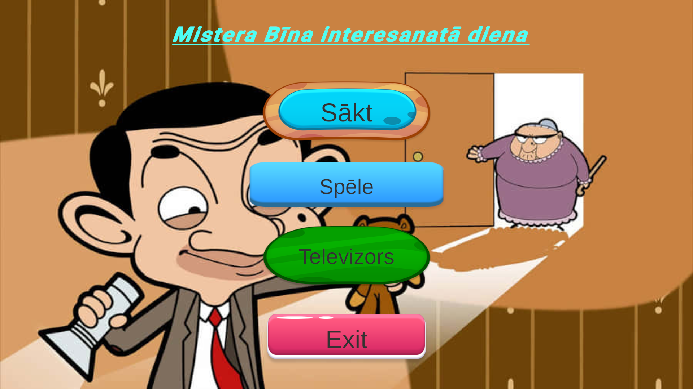
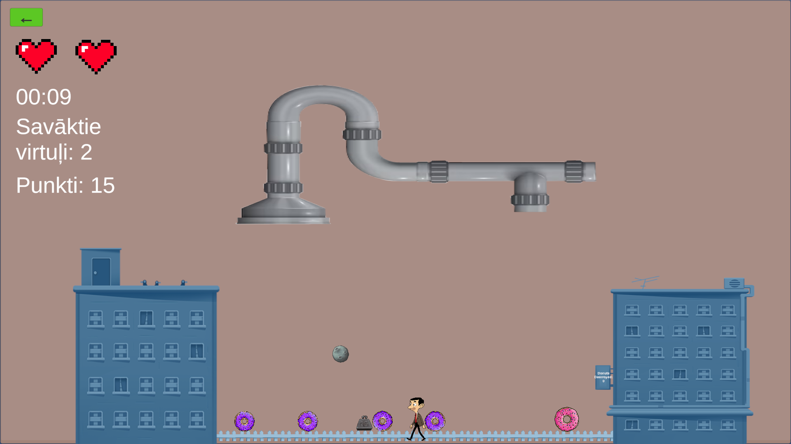
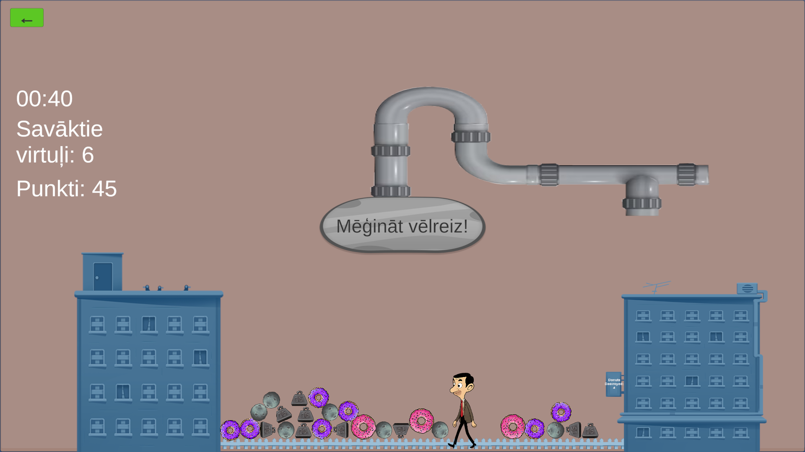
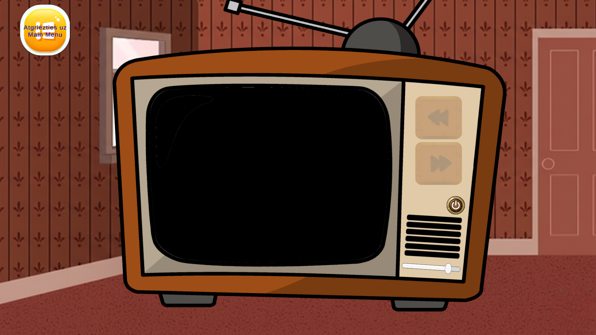

# Unity_bean
Testa projekts, kas demonstrē Unity UI elementu lietojumu par tēmu "Mr. Bīns"

# Projekta apraksts
Unity_bean ir 2D mini spēle, kas demonstrē Unity UI elementus un spēles loģikas integrāciju, izmantojot tēmu "Mr. Bins". Projekta mērķis ir apvienot dažādas Unity funkcionalitātes vienā interaktīvā spēlē.
Spēlētājam ir iespēja kontrolēt MrBean tēlu un cenšas savākt krītošos virtuļus, vienlaikus izvairoties no bīstamiem objektiem (asteroīdiem un svariem), kas samazina dzīvību skaitu.
Turklāt, spēlētājs var arī izpētīt televizora sadaļu programmā.

**Darāmo darbu saraksts:**
- [x] Ui Button lietojums
- [x] UI Input field
- [x] UI Text lietojums
- [x] UI Image lietojums
- [x] UI radio button lietojums
- [x] UI slider lietojums
- [x] Drag and drop funkcionalitāte
- [x] Audio source lietojums
- [x] Riggid body un collider lietojums
- [x] Projekta sagatavošana Windows OS
- [x] Izveidot galvenás izvēlnes ainu ( paši )
- [x] izveidot TV ainu (paši)
- [x] Integrēt virtuļu ķeršanas spēli
- [x] Izveidot Jiggle skriptu
- [x] Izveidot virtuļu ķeršanas spēli
   - [x] Dzīvības sistēma
   - [x] Spēļu restartēšanas iespēja
   - [x] Atšķirīgi punktu vērtība attiecīgiem virtuļiem (Roza - 5, violetā - 10)
   - [x] Taimeris
   - [x] Skaņas efekts, kad lietotājs aiztiek objektu, kas nav virtulis
     
# Projekta bilžu apskate

  
   
  Main menu ekrāns

  
   
  Spēles ekrāns (virtuļu ķeršana)

  
   
  Game Over / mēģināt vēlreiz ekrāns

  
   
  TV aina

